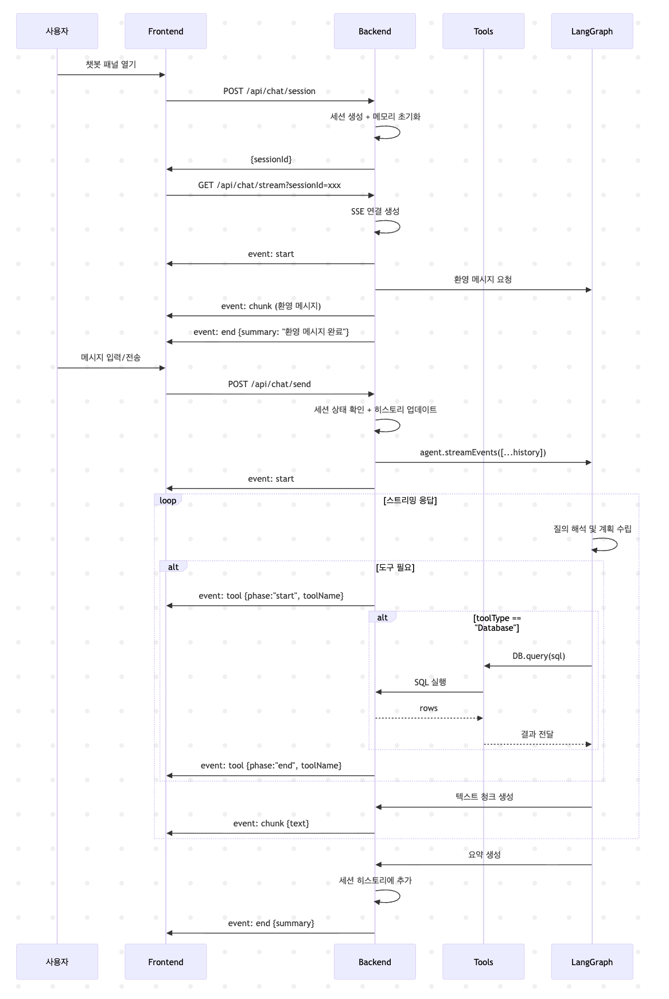
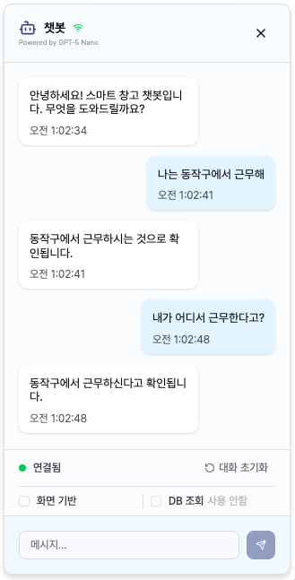
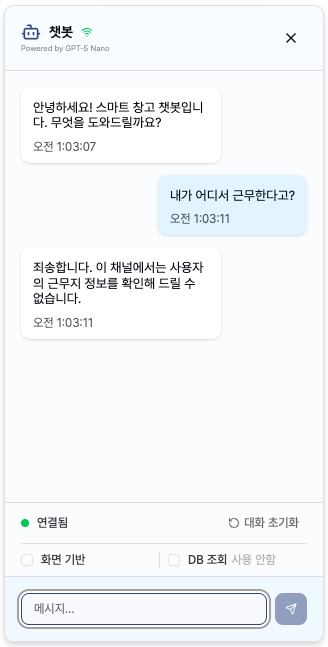

# Smart Warehouse

디지털 트윈에서 영감을 얻는 스마트 창고 시스템입니다.
창고 시뮬레이션과 실시간 대시보드의 두 앱을 하나로 통합하였습니다.
창고 시뮬레이션을 통해 물류창고의 하차를 시뮬레이션하고, 이를 웹소켓으로 전달받아 실시간 대시보드에서 모니터링합니다.
실시간 대시보드의 AI 챗봇에서는 실시간 대시보드의 화면 정보를 기반으로 초소형 인공지능 모델인 Qwen3-0.6B와 대화를 나눌 수 있습니다.

- 프로젝트 시작일 : 2025.07.06
- 프로젝트 1차 배포 : 2025.07.28
- 프로젝트 2차 배포 : 2025.08.22 (LLM 모델 변경 / 아키텍처 변경)
- 배포주소 : [https://warehouse.jongchoi.com](https://warehouse.jongchoi.com)
- 기술스택
  - 프론트엔드 : React, Zustand, Shadcn UI, Tanstack Query, Tanstack Table, Rechart, Socket.io
  - 백엔드 : Express, SQLite, Prisma, Langchain.js, ollama.js

## 창고 시뮬레이션

### 시뮬레이션

컨베이어, 소포, 로봇팔의 3가지 요소와 작업처리/사고처리로 이루어진 물류창고 시뮬레이션입니다.

- 소포 : 하차 작업이 이루어지면 트럭의 위치에서부터 컨베이어를 따라 이동합니다. 컨베이어의 끝에 다다르면 "미처리"로 분류됩니다.
- 로봇팔 : 소포와 대기중인 로봇팔이 가까워지면 로봇팔이 소포를 컨베이어로부터 내려 작업을 처리합니다. 각각의 로봇팔은 소폭 다른 작업처리 시간을 가지고 있습니다.
- 파손(사고) : 일정확율(약 4.9%)로 로봇팔이 작업 중 소포가 파손됩니다. 파손이 일어나면 15초의 작업 처리 시간이 소요됩니다.

### 시뮬레이션 제어

- 작업자 수 : 컨베이어 상에 투입할 로봇팔의 갯수를 제어합니다. 로봇팔의 수가 늘어나면 미처리율이 감소합니다.
- 벨트 속도 : 컨베이어 상에서 소포가 이동하는 속도를 제어합니다. 속도가 상승하면 보다 많은 로봇들이 작업을 배분받을 수 있지만, 미처리율이 증가합니다.
- 하차 간격 : 컨베이어 상에 소포가 놓이는 속도를 제어합니다.
- 작업 속도 : 로봇팔이 소포를 처리하는 평균 처리시간을 제어합니다. 하차 간격과 작업 속도를 조절하여 전체적인 소포 처리건수를 조정할 수 있습니다.

### 시뮬레이션 모니터링

- 하차된 소포와 작업자들의 처리현황을 확인합니다.
- "시스템 메시지"를 통해 시뮬레이션 창고에서 발송하는 메시지를 확인할 수 있습니다.

### UI/UX

- 창고 시뮬레이션의 현실감을 살리기 위해 2.5D의 SVG 이미지들을 사용하였으며, 2D 평면으로 기능을 구현한 후, 코사인 30도를 기준으로 2.5D로 변환하는 유틸 함수([calculations.ts](/frontend/src/utils/warehouse/calculations.ts))를 만들어 2.5D SVG와 어울리도록 구현하였습니다.
- 이동하는 소포와 로봇팔의 쿨타임 부분을 실시간으로 렌더링하기 위해 requestAnimationFrame으로 렌더링 하는 한편, 이를 사용하는 작업자 컴포넌트([Worker.tsx](/frontend/src/components/warehouse/warehouse2d/components/Worker.tsx)), 소포 컴포넌트([MovingBox.tsx](/frontend/src/components/warehouse/warehouse2d/components/MovingBox.tsx))가 useRef, react.Memo 등을 통해 상태와 로직이 전체 시뮬레이션으로부터 분리되도록 하여 최소한의 컴포넌트만 실시간 리렌더링이 이루어질 수 있도록 성능을 최적화하였습니다.

## 대시보드

### 실시간 모니터링

- Broadcast Channel API를 통해 창고 시뮬레이션으로부터 실시간 응답을 받습니다. Broadcast Channel API로 받는 메시지(작업 처리 시작, 작업 처리 종료, 사고 등) Zustand의 상태를 실시간으로 업데이트하여 창고의 상태를 모니터링합니다.
- 창고 시뮬레이션과 대시보드가 같은 브라우저의 같은 탭에서도 응답을 주고받을 수 있도록 Broadcast Channel API를 확장하여 적용하였습니다.([broadcastChannel.ts](/frontend/src/utils/broadcastChannel.ts))

### 데이터 조회 및 통계

- 백엔드는 지역별 매출, 운송장별 처리 현황 등의 과거 데이터를 Prisma와 SQLite로 관리하도록 구성하였고, 프론트엔드에서는 Tanstack Query로 이를 조회합니다.
- 조회된 데이터는 Tanstack Table을 통해 테이블을 생성하고 필터링할 수 있도록 구현하였습니다.

## 챗봇

> **2025-08-22** 업데이트 내역
>
> - Tool Calls 기능이 포함된 gpt-5-nano 모델이 출시됨에 따라 기존에 사용하던 qwen-3-0.6b 모델에서 gpt-5-nano 모델로 변경이 있었습니다.
> - 모델 변경과 함께 웹 소켓 방식에서 SSE 방식으로 아키텍처를 변경하였습니다.
> - 이제 인공지능 모델이 DB를 직접 조회할 수 있습니다.
> - 프론트엔드의 챗봇 패널에 렌더링 성능 개선 작업이 있었습니다.

### 챗봇 시퀀스 다이어그램

- Server-Sent Events를 통해 백엔드와 실시간으로 소통하도록 구현하였습니다.
- LangGraph.js를 활용하여 인공지능 에이전트가 DB의 정보를 조회하고 응답할 수 있습니다.
- 인공지능 에이전트 모델은 GPT-5-nano 모델이 사용되었습니다.

### 화면 기반 대화

- 화면 기반 대화를 켜면, 인공지능이 사용자의 화면에 있는 정보를 기반으로 응답합니다.
- 테이블을 마크다운 형태로 파싱하는 유틸함수([tableToMarkdown.ts](/frontend/src/utils/tableToMarkdown.ts))를 통해 화면 상의 테이블을 마크다운 형태의 메시지로 담아 전송하게 됩니다.

### DB기반 대화

  
  

- 사용자가 허용하는 경우 인공지능은 DB 조회 도구를 호출합니다.
- 인공지능의 요청으로 DB를 조회하는 툴 콜링([tools/index](/backend/src/utils/tools))을 통해 DB 조회 데이터를 전달받아 이를 응답에 활용합니다.

### 멀티턴

  
  

- LangChain.js의 체크 포인터를 이용하여 대화의 맥락을 유지한 채 대화가 가능합니다. ([sseChatbotControllers.ts](/backend/src/controllers/sseChatbotControllers/controller.ts))
- 메모리는 각 세션별로 저장되며, 대화를 초기화하면 메모리가 사라집니다.
- 메모리 누수를 막기 위해 각 세션은 일정 시간 활동이 없으면 종료됩니다.

### 프롬프트 엔지니어링

- 주제에서 벗어난 대화를 막도록 프롬프트 엔지니어링이 되어 있습니다.
- gpt-5-nano와 같이 추론 기능이 포함된 LLM들이 프롬프트 제약을 벗어나지 않도록 작동하는 것을 확인할 수 있었습니다.

  
2025.07.28 버전 챗봇 설명

- Socket.io를 통해 웹소켓으로 백엔드와 실시간 소통을 하도록 구현하였습니다.
- 백엔드는 LLM이 호스팅된 서버를 호출하여 응답을 생성하며, LLM로부터 chunk 단위의 응답이 생성되면 실시간으로 이를 전달합니다.

### 화면 기반 대화

- 대시보드 앱의 테이블 렌더링을 TanStack Table로 구현하도록 통일하였습니다.
- 사용자가 화면기반 대화 전송을 요청하면, 각 페이지마다 있는 커스텀 훅을 통해 화면기반 대화를 감지하고, TanStack Table을 마크다운 형태로 파싱하는 유틸함수를 구현([tableToMarkdown.ts](/frontend/src/utils/tableToMarkdown.ts))하여 마크다운 형태의 테이블로 메시지에 담아 함께 전송합니다.

### 멀티턴

- LangChain.js를 이용하여 멀티턴 대화를 구현([chatbotRoutes.ts](/backend/src/routes/chatbotRoutes.ts))하였습니다.
- 마이크로 LLM을 사용하는 프로젝트 특성상 화면 정보와 관련된 컨텍스트를 많이 보관할 수가 없었고, 이에 랭체인 메모리 클래스를 커스텀([chatHistory.ts](/backend/src/utils/chatHistory.ts))하여 특정 메모리를 삭제할 수 있도록하고, 사용자가 메시지를 전송할 때마다 과거의 화면 정보는 삭제하도록 구현하였습니다.

### LLM 성능 비교표

- 챗봇을 위한 LLM은 오라클 클라우드 플랫폼의 무료 인스턴스인 VM.Standard.A1.Flex 4ocpu로 셀프 호스팅 하였습니다.
- LLM 성능 비교표
  | 모델명 | 입력 처리 시간 (1200토큰) | 메모리 사용량 | 답변 정확도 |
  | --------------------- | -------- | ------------- | ----------- |
  | gpt-4o-mini | 2초 | 0 | 매우높음 |
  | HyperCLOVAX-SEED 0.5B | **30초** | 1.238GiB | 낮음 |
  | HyperCLOVAX-SEED 1.5B | **1분** | 1.844GiB | **높음** |
  | HyperCLOVAX-SEED 3.0B | 2분 20초 | 3.069GiB | **높음** |
  | Qwen3 0.6B | **45초** | 1.541GiB | 보통 |
  | Qwen3 0.6B Q4_K_S | **42초** | 1.257GiB | 낮음 |
  | Qwen3 1.7B | 1분 40초 | 2.327GiB | 보통 |
  | exaone3.5 2.4B | 2분 10초 | 2.295GiB | **높음** |

- 셀프 호스팅 환경에서 사용이 가능한 수준의 응답 속도를 보여준 모델은 HyperCLOVAX-SEED 0.5B (_40tokens/sec_), Qwen3 0.6B (_30tokens/sec_), HyperCLOVAX-SEED 1.5B (_20tokens/sec_) 였고, 이 중 HyperCLOVAX-SEED 0.5B는 맥락에 맞지 않는 대답을 하는 비중이 높았습니다.
- 최종적으로 Qwen3 0.6B를 선택하여 적용하였습니다.
  1. 파라미터 수가 적은 만큼 컨텍스트가 커지면 부정확한 답변을 하는 경우가 많았습니다.
  2. 하지만 Thinking모델 특성상 적은 컨텍스트에서는 타 모델들 대비 정확한 답변을 하였으며, 특히 프롬프트 엔지니어링에 따라 답변 정확도와 속도가 개선되는 특성을 보였습니다.
  3. 또한 LLM의 사고과정을 화면에 함께 보여줄 수 있다는 점이 실제 챗봇이 작동하고 있다는 느낌을 주고, 사용자로 하여금 더 나은 질문을 하도록 돕는 효과가 있습니다.
  4. 그 밖에 Funtion Calling 등으로 점차 기능을 확장하거나, 인터페이스가 유사한 OpenAI 모델로 전환할 수 있는 장점이 있습니다.
  

